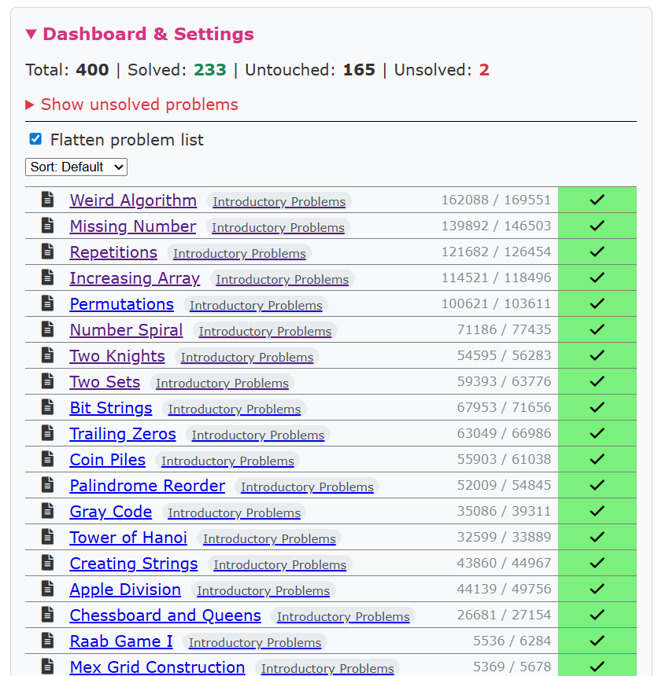
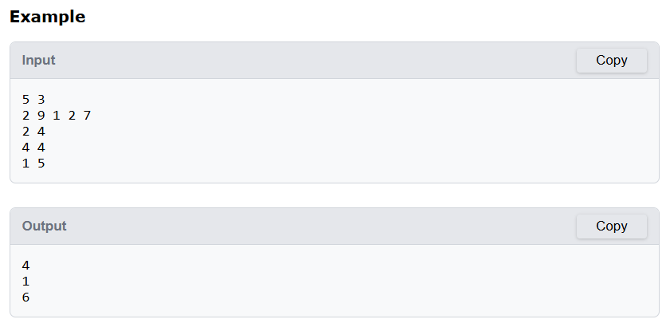

# BetterCSES

**BetterCSES** is a browser extension designed to enhance the user experience on the CSES Online Judge. This project is a fork of [CSES Helper](https://github.com/dada878/CSES-Helper).

## Key Features

The following enhancements are integrated directly into the CSES interface to streamline your competitive programming workflow.

| Feature | Description | Preview |
| :--- | :--- | :--- |
| **Statistics & TOC** | Dashboard navigation and progress tracking. |  |
| **Solved Counter** | Problem count for each topic. |  |
| **Tags & Tips** | Supplemental problem categorizations and hints. |  |
| **Problem Sorting** | Sort the problem set by different criteria. |  |
| **Flatten List** | Toggle a flat list view for all problems. |  |
| **Show Unsolved** | Filter for attempted tasks not yet solved. |  |
| **Copy Example** | One-click copy for sample inputs and outputs. |  |
| **Quick Submission** | Submit code via text area without file upload. |  |
| **Clipboard Tools** | Copy source code and shared solutions. |     |
| **Translation** | Translate problem statements (Beta). |  |
