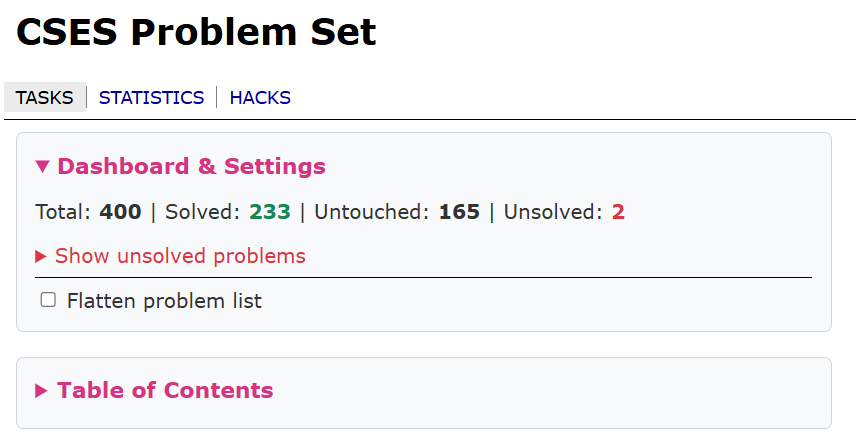
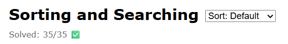
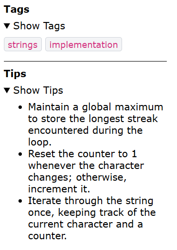
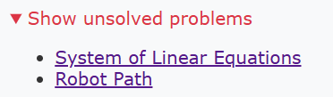
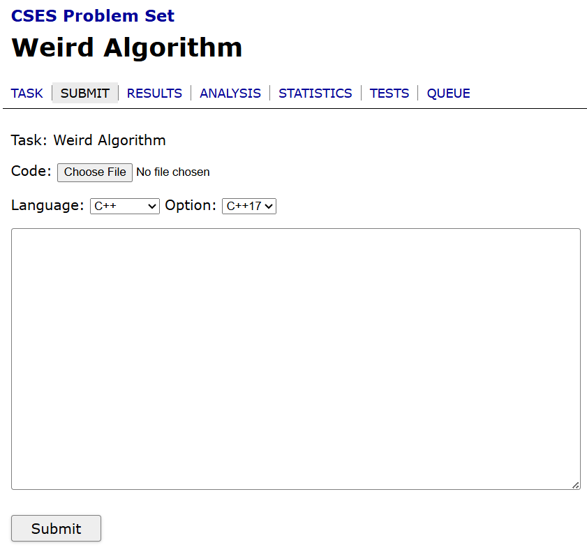
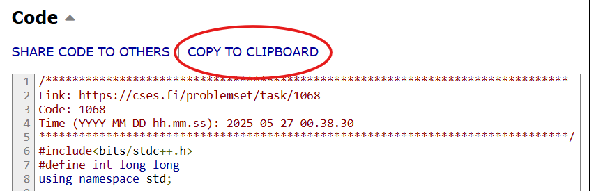
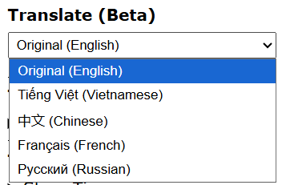

# BetterCSES

**BetterCSES** is a browser extension designed to enhance the user experience on the CSES Online Judge. This project is a fork of [CSES Helper](https://github.com/dada878/CSES-Helper).

## Key Features

The following enhancements are integrated directly into the CSES interface to streamline your competitive programming workflow.

| Feature | Description | Preview |
| :--- | :--- | :--- |
| **Statistics & TOC** | Track progress and navigate via a Table of Contents on the dashboard. |  |
| **Solved Counter** | View the number of solved problems for each specific topic. |  |
| **Tags & Tips** | Access community-driven hints and problem categorizations. |  |
| **Sorting & Filtering** | Sort problems or flatten the list to show only unsolved tasks. |  |
| **Quick Submission** | Submit code via text area without the need to upload files. |  |
| **Clipboard Tools** | One-click copy for your code and shared solutions. |  |
| **Translation** | Beta support for translating problem statements into other languages. |  |
